## GRUPO DE TRABAJO 05

## INTEGRANTES DEL GRUPO
#### Jhohan David Contreras Aragón		1007687796
#### Andrés Felipe Medina Medina 		1015464557
#### Mitchell Elizabeth Rodríguez Barreto	1032503089

## Simulación funcionamiento de la cámara

En el presente documento se mostrará la simulación y algunos cambios realizados al módulo de captura de datos con el fin de observar su funcionamiento, sin tener la incertidumbre si lo que se tiene incorrecto es la captura o la configuración de la cámara con Arduino.

Para esto primero se realiza la simulación sin modificar el fichero ***cam_read.v***, como se observa, la simulación muestra dos pantallas, ambas con un cuadro de líneas azules y rosadas, tal como se ve en una pantalla VGA cuando no se conecta una cámara. La imagen se debe a que es el valor inicial configurado en la memoria RAM (***buffer_ram_dp.v***).

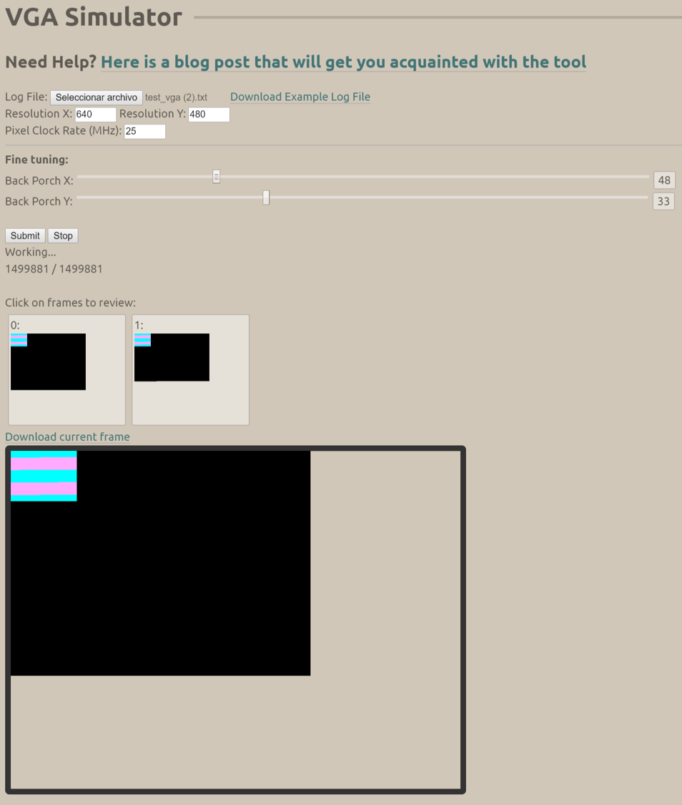

Luego se procede a diseñar el módulo ***cam_read.v*** que corresponde a la captura de datos y almacenamiento en la RAM, en este caso se modifica el archivo ***captura_de_datos_downsampler.v*** presentado en [work02-captura-datos-0v7670-grupo-05](https://github.com/unal-edigital1-2019-2/work02-captura-datos-0v7670-grupo-05/blob/master/hdl/src/captura_de_datos_downsampler.v), debido  que presenta algunas fallas en su funcionamiento. 

Primero se declara el módulo y se asignan los valores de entrada y salida (éstas se dieron en la plantilla WP03). Además, se crea una variable interna de tipo registro para que haga la función de contador.

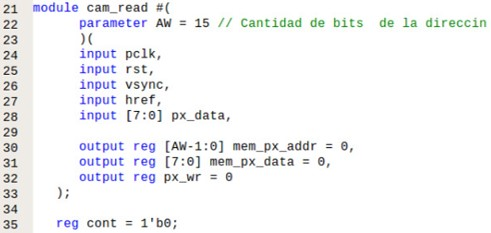

#### Entradas:
* *pclk:* Señal *PCLK* dada por la cámara.
* *rst:* Reset.
* *vsync:* Señal *VSYNC* dada por la cámara.
* *href:* Señal *HREF* dada por la cámra.
* *px_data[7:0]:* Señal de 8 bits dada por la cámara la cual contiene la información de los colores (**D[7:0]**).

#### Salidas:
* *mem_px_addr[15-1:0]:* Variable de 15 bits que almacena la dirección en donde se guardaran los datos del color.
* *mem_px_data[7:0]* Variable de 8 bits que almacena la información del color, en éste caso formato RGB332.
* *px_wr:* Variable que controla la escritura de los datos en la RAM.

**Nota:** Todas las salidas son registros debido a que almacenan datos.

El diagrama estructural es el siguiente:

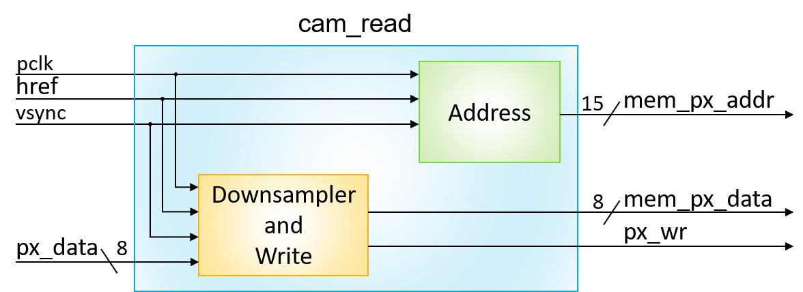

Luego se guarda la información de color en *mem_px_data*, los primeros seis bits más significativos corresponden al rojo y al verde y son capturados del primer byte de un pixel (formato RGB565) en el cual la varible *cont* es igual a cero, los dos últimos son capturados en el último byte del pixel, con *cont* igual a 1. También, se debe tener cuenta que sólo se recopilan los datos cuando *PCLK* y *HREF* están en flanco de subida y *VSYNC* en flanco de bajada.

El registro de escritura *px_wr* se mantiene en cero cuando se capturan los primeros seis bits y cuando *HREF* están en flanco de bajada, cambia a 1 cuando ya se han capturado los últimos dos bits y está listo para escribir en la RAM.

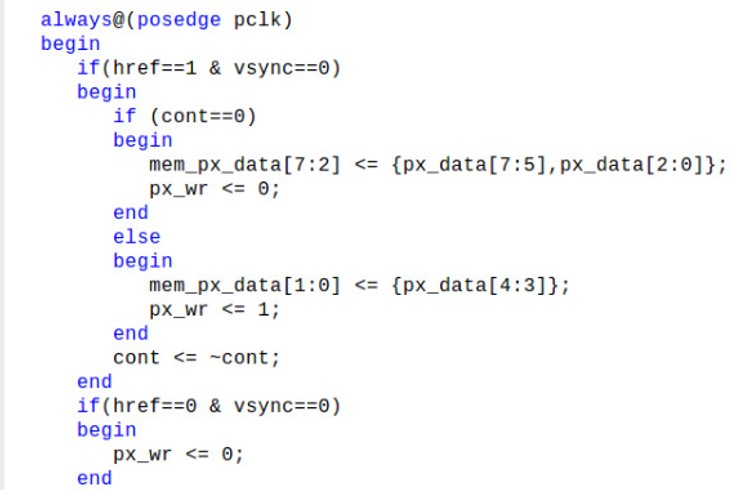

La dirección de entrada *mem_px_addr* se modifica cada que el contador es igual a 1, y su valor va incrementado en uno.

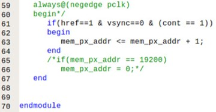

A continuación se muestra el diagrama funcional para poder visualizar de forma más clara la operación del módulo de captura de datos.

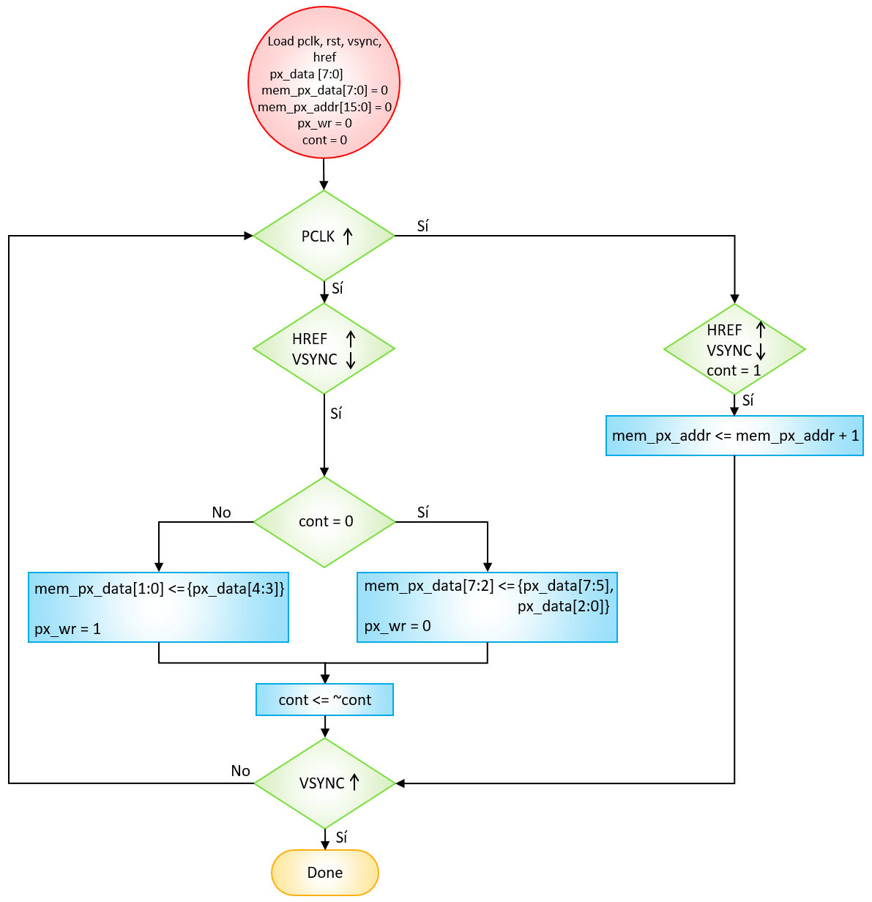

La simulación muestra en la primera pantalla el valor inicial que tiene la RAM, y en la segunda un cuadro rojo que ocupa toda la pantalla, esto se debe a que la dirección va aumentando en uno y nunca regresa a cero. 

Si se le quita el comentario a las líneas 65 y 66, se observa que la imagen tiene el tamaño correcto.

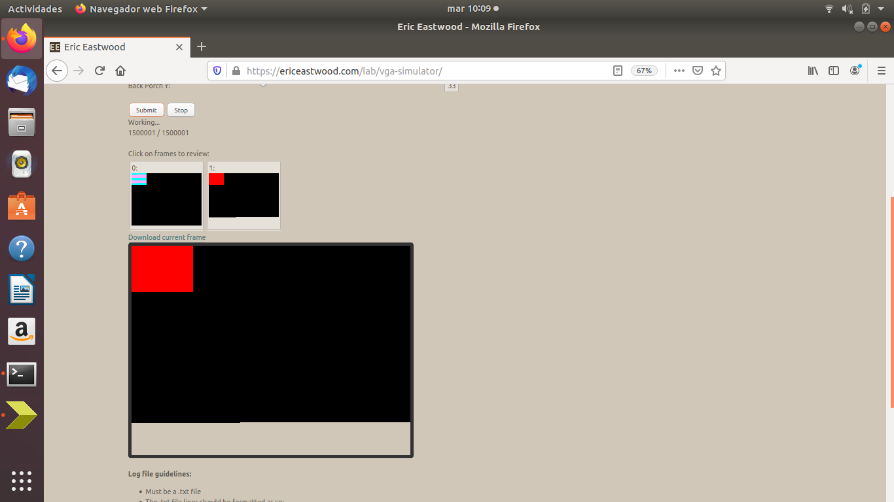

Al realizar la implementación se siguió observando la misma imagen lluviosa en la pantalla VGA, por lo que se prosiguió a revisar si la captura de datos estaba contando de forma correcta los flancos de subida de la señal *HREF*.

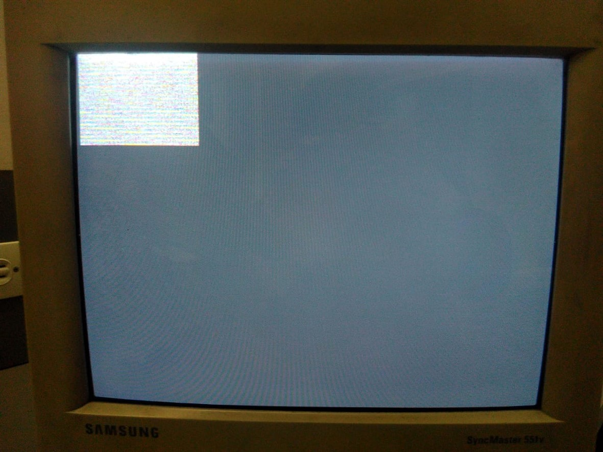

Para hacer el conteo se diseñó la siguiente máquina de estados: 

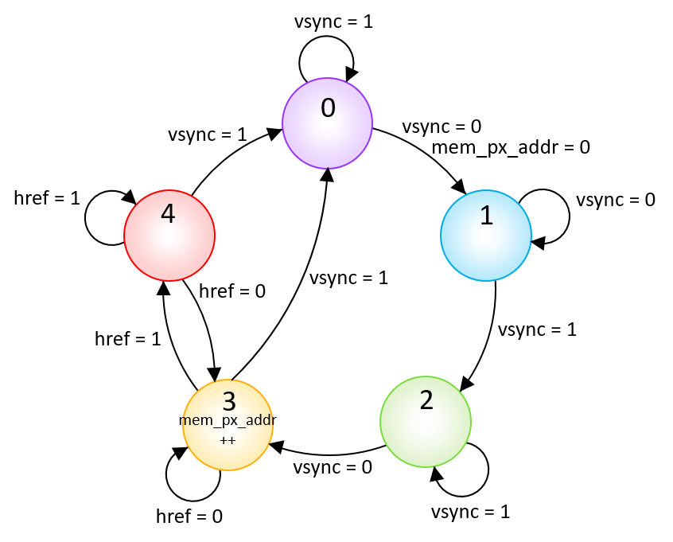

Se declara el módulo **cam_read_lecture.v** y se asignan los mismos valores de entrada y salida del módulo **cam_read.v**; además, se crea una variable *fsm_state* de tipo registro de 3 bits que representará los estados 5 estados de la máquina.

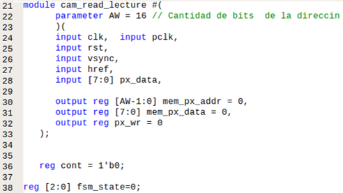

Para realizar la máquina se usa la estructura de control *case*, que permite evaluar las condiciones y cambiar de un estado a otro. También, se adiciona un reset con el fin de reiniciar las variables *mem_px_addr* y *fsm_state* en cero. Esto se realiza en los flancos de subida de la señal *PCLK* para que tenga un funcionamiento síncrono.

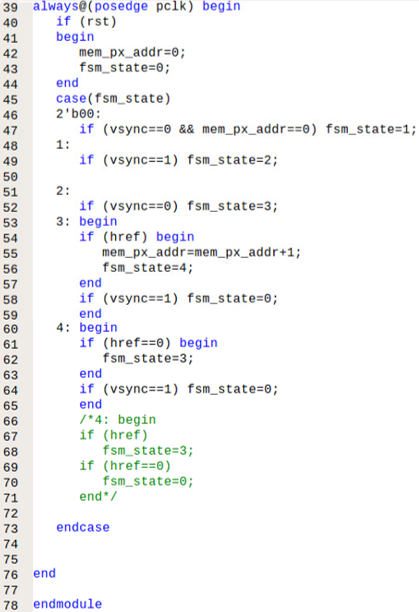

Como la cantidad de *HREF* que la captura de datos está leyendo es correcto, se pasa a revisar el funcionamiento sin la cámara, para eso se conectaron los pines *CAM_px_data* 5, 6 y 7 a *VCC* (3,3 V) y los pines *CAM_px_data* restantes a *GND* con el fin de obtener un cuadro rojo como en la simulación. Si se deseara un cuadro verde se conectarían los pines 0, 1 y 2 a *VCC* y los demás a *GND*; en el caso de azul sólo se conectarían 3 y 4 a *VCC*.

Los pines en la FPGA están organizados de la siguiente manera:

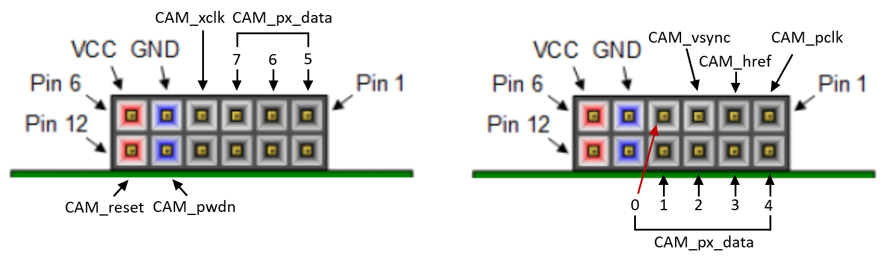

Al conectar los pines como se mencionó anteriormente se observa:

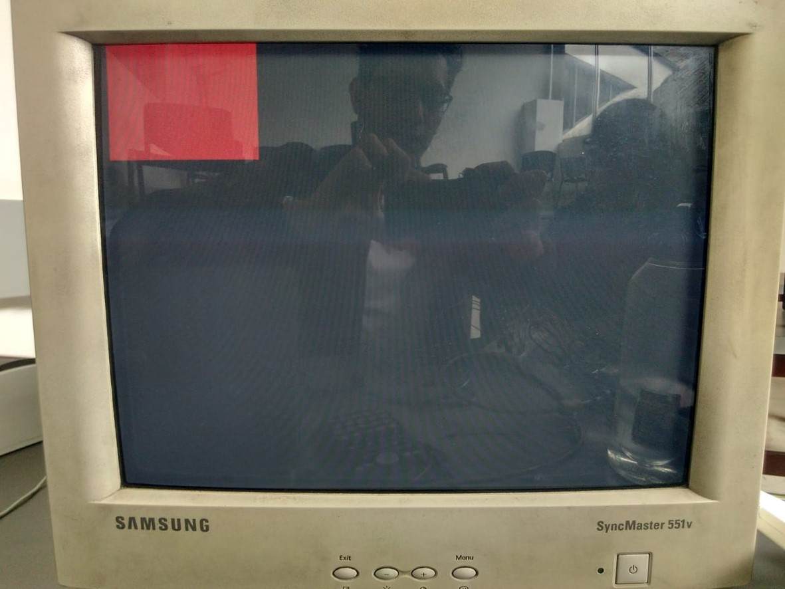

Como el problema persiste, se continúa con la revisión de la configuración de la cámara por medio de Arduino. Ésta queda de la siguiente forma:

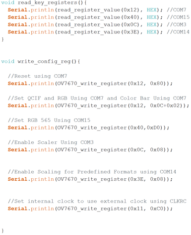

#### Registros
* ***COM7***: Dirección en hexadecimal *0x12*.
    * Reestablecer los registros.
**Configuración (**hex**):** 0x80.    **Configuración (**binario**):** 10000000.

Bits | Descripción | Configuración
------------ | ------------- | -------------
Bit[7] | SCCB Reestablecer registro | 1: Reestablecer todos los registros a los valores predeterminados
Bit[6] | Reservado | 0
Bit[5] | Formato de salida – Selección CIF | 0
Bit[4] | Formato de salida – Selección QVGA | 0
Bit[3] | Formato de salida – Selección QCIF | 0
Bit[2] | Formato de salida – Selección RGB | 0: YUV
Bit[1] | Habilitar barra de color | 0: Inhabilitar
Bit[0] | Formato de salida – Raw RGB | 0: YUV

    * Formato de salida.
**Configuración (**hex**):** 0x0C + 0x02.    **Configuración (**binario**):** 00001100 + 00000010.

Bits | Descripción | Configuración
------------ | ------------- | -------------
Bit[7] | SCCB Reestablecer registro | 0: No cambiar
Bit[6] | Reservado | 0
Bit[5] | Formato de salida – Selección CIF | 0
Bit[4] | Formato de salida – Selección QVGA | 0
Bit[3] | Formato de salida – Selección QCIF | 1
Bit[2] | Formato de salida – Selección RGB | 1: RGB
Bit[1] | Habilitar barra de color | 0: Inhabilitar
Bit[0] | Formato de salida – Raw RGB | 0: RGB

* ***COM15***: Dirección en hexadecimal *0x40*.
    * Formato y tamaño del pixel.
**Configuración (**hex**):** 0xD0.    **Configuración (**binario**):** 11010000.

Bits | Descripción | Configuración
------------ | ------------- | -------------
Bit[7:6] | Formato de dato | 11: Rango de salida: [00] a [FF] 
Bit[5:4] | Reservado | 01: RGB565, efectivo solo cuando RGB44 es bajo 
Bit[3:0] | Reservado | 0000

* ***COM3***: Dirección en hexadecimal *0x0C*.
    * Habilitar escalado.
**Configuración (**hex**):** 0x08.    **Configuración (**binario**):** 00001000.

Bits | Descripción | Configuración
------------ | ------------- | -------------
Bit[7] | Reservado | 0
Bit[6] | Intercambio de datos de salida MSB y LSB | 0
Bit[5] | Opción tri-estado para el reloj de salida en el período de apagado | 0: No tri-estado en este período 
Bit[4] | Opción tri-estado para datos de salida en el período de apagado | 0: No tri-estado en este período
Bit[3] | Escala habilitada | 1: Habilitada
Bit[2] | DCW habilitado | 0: Desabilitada
Bit[1:0] | Reservado | 00

* ***COM14***: Dirección en hexadecimal *0x3E*.
    * Habilitar escalado manual.
**Configuración (**hex**):** 0x08.    **Configuración (**binario**):** 00001000.

Bits | Descripción | Configuración
------------ | ------------- | -------------
Bit[7:5] | Reservado | 000
Bit[4] | DCW y escalado de PCLK habilitado| 0: PCLK normal
Bit[3] | Habilitación de escala manual para modos de resolución predefinidos como CIF, QCIF y QVGA | 1: El parámetro de escalado puede ser habilitado manualmente
Bit[2:0] | Divisor PCLK | 000: Dividir por 1

Los modos de resolución predefinidos son los siguientes:

#### Referencias
* Modos de resolución predefinidos QCIF y CIF: [https://www.vhngroup.com/tecnico-resolucion-de-video-analoga-qcif-cif-4cif-hd1-d1-960h/](https://www.vhngroup.com/tecnico-resolucion-de-video-analoga-qcif-cif-4cif-hd1-d1-960h/).
* Modos de resolución predefinidos QCIF, QVGA y CIF: [https://www.phonescoop.com/glossary/term.php?gid=123](https://www.phonescoop.com/glossary/term.php?gid=123).
* Puertos Pmod: [https://reference.digilentinc.com/reference/programmable-logic/nexys-4-ddr/reference-manual](https://reference.digilentinc.com/reference/programmable-logic/nexys-4-ddr/reference-manual).
* Registros de configuración de la cámara y señales *VSYNC* y *HREF*: [https://github.com/unal-edigital1-2019-2/work03-smulacion-ov7670-grupo-05/blob/master/docs/datasheet/OV7670_2006.pdf](https://github.com/unal-edigital1-2019-2/work03-smulacion-ov7670-grupo-05/blob/master/docs/datasheet/OV7670_2006.pdf).

